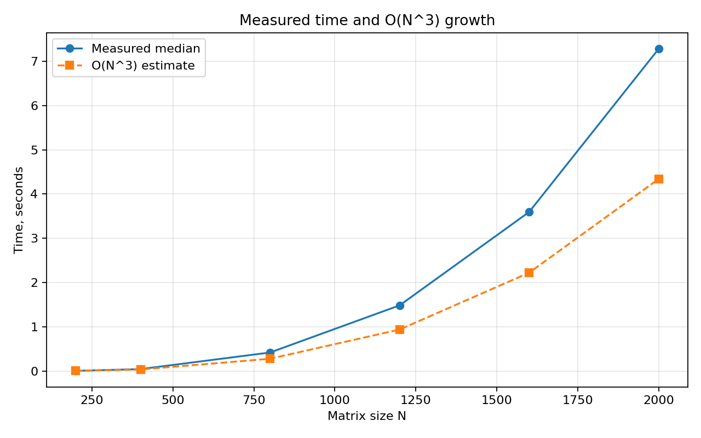

# Лабораторная работа №1. Последовательное перемножение матриц

## Сведения о студенте

- Студент: Мась Андрей Алексеевич
- Группа: 6311
- Зачетная книжка: 2023-01326

## Задание

Написать программу на C/C++ для перемножения двух квадратных матриц. Исходные
матрицы читаются из файлов, результат записывается в файл. В отчете нужно
показать время выполнения, объем задачи и автоматизированную верификацию
результатов с помощью стороннего ПО.

## Теоретические сведения

Для двух квадратных матриц `A` и `B` размера `N x N` результат `C = A * B`
вычисляется по формуле:

```text
C[i][j] = sum(A[i][k] * B[k][j]), k = 0..N-1
```

Классический алгоритм использует три вложенных цикла. Для каждого из `N^2`
элементов результата выполняется `N` умножений и `N - 1` сложений. В отчете
объем задачи оценивается как `2 * N^3` арифметических операций. Поэтому
асимптотическая сложность алгоритма равна `O(N^3)`.

При больших размерах матриц важна не только сложность, но и локальность доступа
к памяти. Если читать столбцы матрицы `B` напрямую, элементы расположены в
памяти не последовательно. Поэтому в реализации матрица `B` предварительно
транспонируется, после чего внутренний цикл читает оба операнда последовательно.

## Реализация

Основная программа находится в [main.cpp](./main.cpp). Умножение реализовано
обычными циклами, без вызова библиотечной функции умножения матриц. Для улучшения
локальности доступа матрица `B` перед вычислением транспонируется, после чего
каждый элемент `C[i][j]` считается как скалярное произведение строки `A` и строки
транспонированной `B`.

Алгоритмическая сложность: `O(N^3)`. Объем вычислительной задачи в отчете
оценивается как `2 * N^3` операций.

## Запуск

```bash
make
./matrix_seq sample_A.txt sample_B.txt result.txt
python3 verify.py sample_A.txt sample_B.txt result.txt
```

Для генерации матриц произвольного размера:

```bash
python3 generate_matrices.py 800 --a A.txt --b B.txt
./matrix_seq A.txt B.txt result.txt
python3 verify.py A.txt B.txt result.txt
```

Полный эксперимент:

```bash
python3 benchmark.py
python3 plot_results.py
```

По умолчанию каждая размерность запускается 3 раза. Для итоговой таблицы и
графика используется медиана времени, чтобы единичные аномальные запуски меньше
влияли на выводы.

## Верификация

Скрипт [verify.py](./verify.py) читает `A`, `B` и `C`, вычисляет `A @ B` через
NumPy и сравнивает результат с файлом программы. Во всех экспериментах
максимальная абсолютная ошибка не превысила `5.74e-07`.

## Результаты экспериментов

Эксперименты выполнены для размеров матриц `200, 400, 800, 1200, 1600, 2000`.
Исходные данные для графика также сохранены в [results.csv](./results.csv).

| N | Повторов | Операции 2*N^3 | Медиана, с | Среднее, с | Мин., с | Std, с | max abs error |
|---:|---:|---:|---:|---:|---:|---:|---:|
| 200 | 3 | 16,000,000 | 0.004341 | 0.004347 | 0.004307 | 0.000044 | 1.41e-07 |
| 400 | 3 | 128,000,000 | 0.043661 | 0.043738 | 0.043332 | 0.000449 | 2.09e-07 |
| 800 | 3 | 1,024,000,000 | 0.418976 | 0.419106 | 0.418726 | 0.000460 | 3.40e-07 |
| 1200 | 3 | 3,456,000,000 | 1.484108 | 1.492099 | 1.483879 | 0.014040 | 3.77e-07 |
| 1600 | 3 | 8,192,000,000 | 3.595169 | 3.600430 | 3.574186 | 0.029232 | 4.72e-07 |
| 2000 | 3 | 16,000,000,000 | 7.282340 | 7.280559 | 7.176489 | 0.103192 | 5.74e-07 |

## График




## Выводы

В лабораторной работе была реализована базовая последовательная версия
перемножения матриц. Результаты корректны: автоматическая проверка через NumPy
для всех размеров показала ошибку не выше `5.74e-07`.

Экспериментально подтвержден кубический рост времени. При увеличении `N` с 200
до 2000 объем задачи увеличивается с `16,000,000` до `16,000,000,000` операций,
и время возрастает с миллисекунд до нескольких секунд. Небольшие отклонения от
идеальной кривой `O(N^3)` объясняются кэшами процессора, оптимизациями
компилятора и работой подсистемы памяти.

Повторные запуски показывают небольшой, но заметный разброс времени, особенно
на больших размерах. Поэтому в дальнейших лабораторных работах эта версия
используется как базовая точка сравнения, а основным временем считается медиана
трех запусков.
