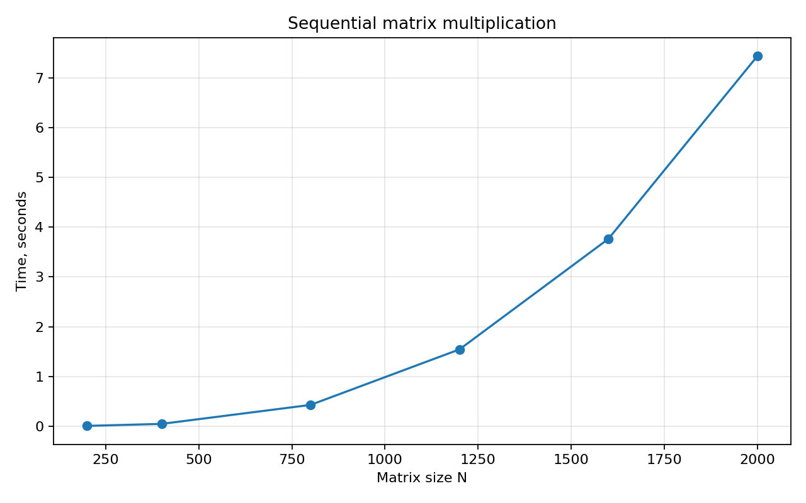

# Лабораторная работа №1. Последовательное перемножение матриц

## Задание

Написать программу на C/C++ для перемножения двух квадратных матриц. Исходные
матрицы читаются из файлов, результат записывается в файл. В отчете нужно
показать время выполнения, объем задачи и автоматизированную верификацию
результатов с помощью стороннего ПО.

## Реализация

Основная программа находится в [main.cpp](./main.cpp). Умножение реализовано
обычными циклами, без вызова библиотечной функции умножения матриц. Для улучшения
локальности доступа матрица `B` перед вычислением транспонируется, после чего
каждый элемент `C[i][j]` считается как скалярное произведение строки `A` и строки
транспонированной `B`.

Алгоритмическая сложность: `O(N^3)`. Объем вычислительной задачи в отчете
оценивается как `2 * N^3` операций.

## Запуск

```bash
make
./matrix_seq sample_A.txt sample_B.txt result.txt
python3 verify.py sample_A.txt sample_B.txt result.txt
```

Для генерации матриц произвольного размера:

```bash
python3 generate_matrices.py 800 --a A.txt --b B.txt
./matrix_seq A.txt B.txt result.txt
python3 verify.py A.txt B.txt result.txt
```

Полный эксперимент:

```bash
python3 benchmark.py
python3 plot_results.py
```

## Верификация

Скрипт [verify.py](./verify.py) читает `A`, `B` и `C`, вычисляет `A @ B` через
NumPy и сравнивает результат с файлом программы. Во всех экспериментах
максимальная абсолютная ошибка не превысила `5.74e-07`.

## Результаты экспериментов

Эксперименты выполнены для размеров матриц `200, 400, 800, 1200, 1600, 2000`.
Исходные данные для графика также сохранены в [results.csv](./results.csv).

| N | Операции 2*N^3 | Время, с | max abs error |
|---:|---:|---:|---:|
| 200 | 16,000,000 | 0.004365 | 1.41e-07 |
| 400 | 128,000,000 | 0.044435 | 2.09e-07 |
| 800 | 1,024,000,000 | 0.425851 | 3.40e-07 |
| 1200 | 3,456,000,000 | 1.542177 | 3.77e-07 |
| 1600 | 8,192,000,000 | 3.764717 | 4.72e-07 |
| 2000 | 16,000,000,000 | 7.441149 | 5.74e-07 |

## График



## Выводы

Последовательная программа корректно перемножает матрицы, что подтверждается
сравнением с NumPy. Рост времени выполнения соответствует кубической сложности:
при переходе от `N=1000`-порядка к `N=2000` объем операций становится очень
заметным. Эта версия используется как базовая точка сравнения для OpenMP и MPI.
