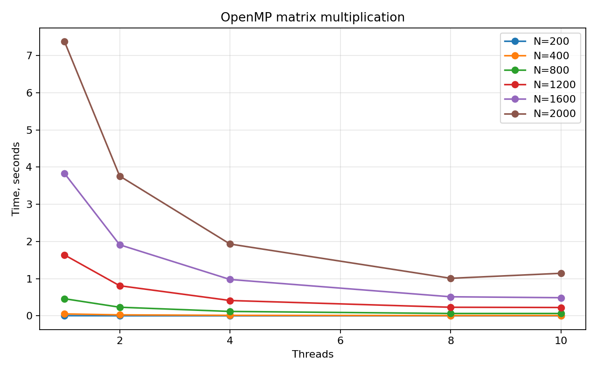
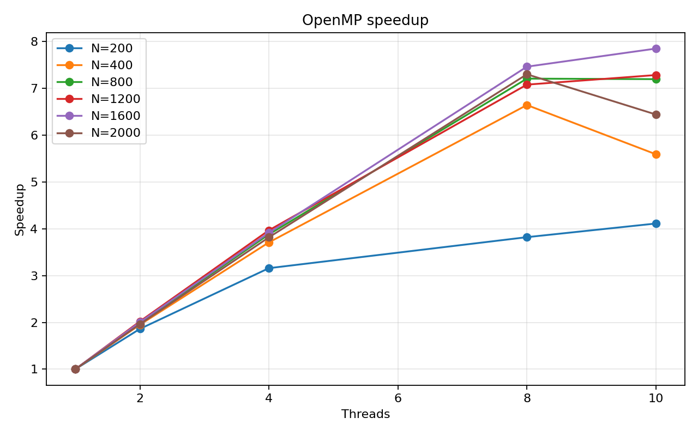

# Лабораторная работа №2. OpenMP

## Задание

Модифицировать программу из лабораторной работы №1 для параллельной работы по
технологии OpenMP. Провести серию экспериментов с разным количеством потоков и
разными размерами матриц.

## Реализация

Основная программа находится в [main.cpp](./main.cpp). Параллелизация выполнена
директивой OpenMP для внешнего цикла по строкам результирующей матрицы:

```cpp
#pragma omp parallel for schedule(static)
```

Каждый поток вычисляет независимый набор строк `C`, поэтому синхронизация внутри
основного вычислительного цикла не требуется.

## Запуск

На macOS для OpenMP использовался Homebrew GCC:

```bash
make
./matrix_omp sample_A.txt sample_B.txt result.txt 4
python3 verify.py sample_A.txt sample_B.txt result.txt
```

Полный эксперимент:

```bash
python3 benchmark.py
python3 plot_results.py
```

Каждая пара `размер матрицы / число потоков` запускается 3 раза. Для графиков
используется медиана времени, а полные агрегированные данные сохранены в
[results.csv](./results.csv).

## Верификация

Результаты каждого запуска сравнивались с NumPy. Максимальная абсолютная ошибка
во всей серии экспериментов не превысила `5.74e-07`.

## Результаты экспериментов

Размеры матриц: `200, 400, 800, 1200, 1600, 2000`. Количество потоков:
`1, 2, 4, 8, 10`.

| N | 1 поток(ов) | 2 поток(ов) | 4 поток(ов) | 8 поток(ов) | 10 поток(ов) | Лучшее время | Лучшее число потоков |
|---:|---:|---:|---:|---:|---:|---:|---:|
| 200 | 0.005174 | 0.002781 | 0.001638 | 0.001354 | 0.001258 | 0.001258 | 10 |
| 400 | 0.051928 | 0.026631 | 0.013997 | 0.007814 | 0.009284 | 0.007814 | 8 |
| 800 | 0.461236 | 0.232296 | 0.118861 | 0.063973 | 0.064071 | 0.063973 | 8 |
| 1200 | 1.638972 | 0.810899 | 0.413020 | 0.231440 | 0.224929 | 0.224929 | 10 |
| 1600 | 3.832117 | 1.912062 | 0.978956 | 0.513317 | 0.488038 | 0.488038 | 10 |
| 2000 | 7.378029 | 3.761292 | 1.932582 | 1.010286 | 1.145038 | 1.010286 | 8 |

## Графики





## Выводы

OpenMP-версия дает устойчивое ускорение на больших матрицах. Для `N=2000`
время уменьшилось с `7.378029` с на одном потоке до `1.010286` с на 8 потоках.
Использование 10 потоков не всегда лучше: для `N=2000` медиана на 10 потоках
хуже, чем на 8 потоках. Это показывает влияние планировщика ОС, конкуренции за
ресурсы и накладных расходов при большом числе потоков.
