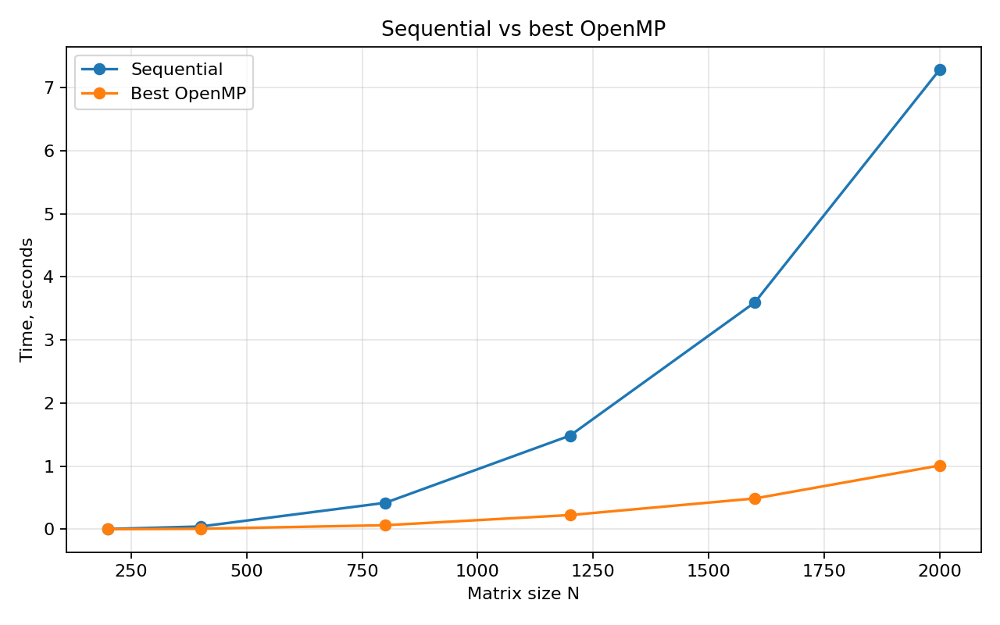
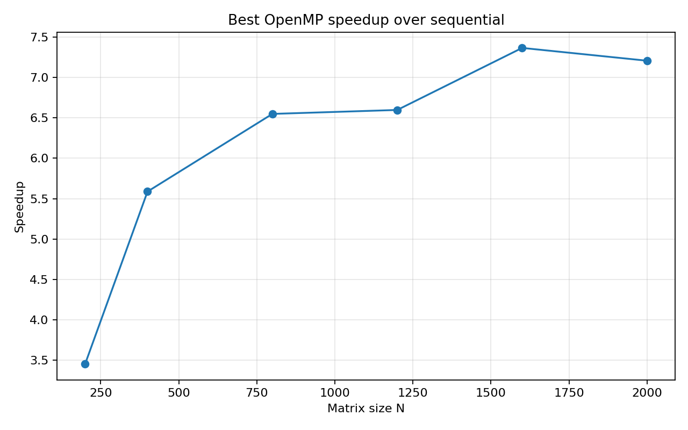

# Лабораторная работа №2. OpenMP

## Сведения о студенте

- Студент: Мась Андрей Алексеевич
- Группа: 6311
- Зачетная книжка: 2023-01326

## Задание

Модифицировать программу из лабораторной работы №1 для параллельной работы по
технологии OpenMP. Провести серию экспериментов с разным количеством потоков и
разными размерами матриц.

## Теоретические сведения

OpenMP предназначен для параллельного программирования на системах с общей
памятью. Программа запускается как один процесс, внутри которого создается
несколько потоков. Все потоки видят одни и те же массивы `A`, `B` и `C`, поэтому
не требуется явная передача сообщений между исполнителями.

В задаче перемножения матриц элементы результата независимы друг от друга:
вычисление `C[i][j]` не зависит от других элементов `C`. Это делает внешний цикл
по строкам удобной областью распараллеливания. Основные метрики:

- ускорение: `S(p) = T(1) / T(p)`;
- эффективность: `E(p) = S(p) / p`;
- лучшая конфигурация: число потоков, при котором медианное время минимально.

На практике ускорение ограничивается накладными расходами создания потоков,
планировщиком ОС, пропускной способностью памяти и конкуренцией потоков за
общие кэши.

## Системные характеристики

- Машина: MacBook Pro.
- Процессор: Apple M1 Pro, 10 CPU cores (`8 Performance + 2 Efficiency`).
- Память: 16 GB.
- ОС: macOS 26.4.1.
- Компилятор: Homebrew GCC `g++-15` 15.2.0.
- Флаги компиляции: `-O3 -std=c++17 -Wall -Wextra -fopenmp`.
- Проверенное число потоков: `1, 2, 4, 8, 10`.

## Реализация

Основная программа находится в [main.cpp](./main.cpp). Параллелизация выполнена
директивой OpenMP для внешнего цикла по строкам результирующей матрицы:

```cpp
#pragma omp parallel for schedule(static)
```

Каждый поток вычисляет независимый набор строк `C`, поэтому синхронизация внутри
основного вычислительного цикла не требуется.

## Запуск

На macOS для OpenMP использовался Homebrew GCC:

```bash
make
./matrix_omp sample_A.txt sample_B.txt result.txt 4
python3 verify.py sample_A.txt sample_B.txt result.txt
```

Полный эксперимент:

```bash
python3 benchmark.py
python3 plot_results.py
```

Каждая пара `размер матрицы / число потоков` запускается 3 раза. Для графиков
используется медиана времени, а полные агрегированные данные сохранены в
[results.csv](./results.csv).

## Верификация

Результаты каждого запуска сравнивались с NumPy. Максимальная абсолютная ошибка
во всей серии экспериментов не превысила `5.74e-07`.

## Результаты экспериментов

Размеры матриц: `200, 400, 800, 1200, 1600, 2000`. Количество потоков:
`1, 2, 4, 8, 10`.

| N | 1 поток(ов) | 2 поток(ов) | 4 поток(ов) | 8 поток(ов) | 10 поток(ов) | Лучшее время | Лучшее число потоков |
|---:|---:|---:|---:|---:|---:|---:|---:|
| 200 | 0.005174 | 0.002781 | 0.001638 | 0.001354 | 0.001258 | 0.001258 | 10 |
| 400 | 0.051928 | 0.026631 | 0.013997 | 0.007814 | 0.009284 | 0.007814 | 8 |
| 800 | 0.461236 | 0.232296 | 0.118861 | 0.063973 | 0.064071 | 0.063973 | 8 |
| 1200 | 1.638972 | 0.810899 | 0.413020 | 0.231440 | 0.224929 | 0.224929 | 10 |
| 1600 | 3.832117 | 1.912062 | 0.978956 | 0.513317 | 0.488038 | 0.488038 | 10 |
| 2000 | 7.378029 | 3.761292 | 1.932582 | 1.010286 | 1.145038 | 1.010286 | 8 |

## Графики






## Сравнение с лабораторной работой №1

| N | Sequential, с | Best OpenMP, с | Лучшее число потоков | Ускорение |
|---:|---:|---:|---:|---:|
| 200 | 0.004341 | 0.001258 | 10 | 3.45x |
| 400 | 0.043661 | 0.007814 | 8 | 5.59x |
| 800 | 0.418976 | 0.063973 | 8 | 6.55x |
| 1200 | 1.484108 | 0.224929 | 10 | 6.60x |
| 1600 | 3.595169 | 0.488038 | 10 | 7.37x |
| 2000 | 7.282340 | 1.010286 | 8 | 7.21x |

## Выводы

OpenMP-версия дает устойчивое ускорение по сравнению с последовательной
лабораторной работой №1. Для `N=2000` время уменьшилось с `7.282340` с до
`1.010286` с, то есть ускорение составило `7.21x`.

Лучшее число потоков зависит от размера задачи. Для `N=400` и `N=800`
минимальная медиана получилась на 8 потоках, для `N=1200` и `N=1600` - на 10
потоках, а для `N=2000` снова лучше оказались 8 потоков. Это показывает, что
увеличение числа потоков само по себе не гарантирует ускорение: при большом
числе потоков растут накладные расходы и нагрузка на память.

По сравнению с последовательным методом OpenMP хорошо подходит для общей памяти
и требует минимальных изменений в коде. Главный практический плюс - простое
распараллеливание циклов, главный минус - зависимость результата от числа ядер,
планировщика ОС и пропускной способности памяти.
