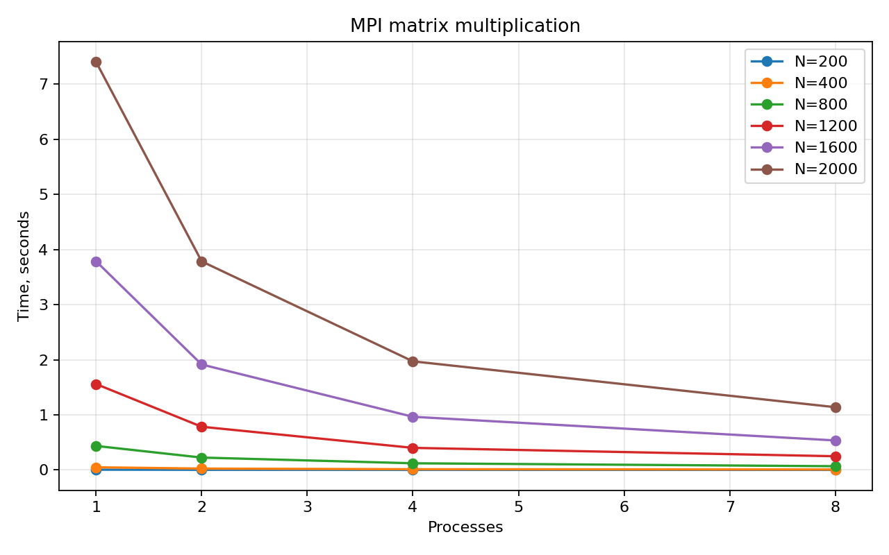
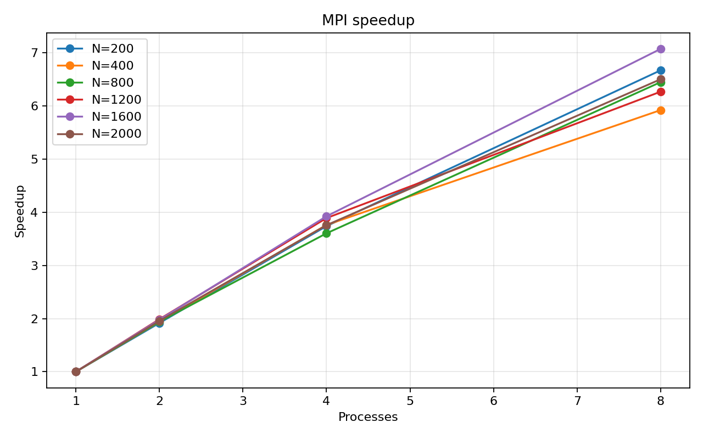

# Лабораторная работа №3. MPI

## Задание

Модифицировать программу из лабораторной работы №1 для параллельной работы по
технологии MPI. Провести серию экспериментов с разными размерами матриц и
разным количеством вычислительных процессов.

## Реализация

Основная программа находится в [main.cpp](./main.cpp). Процесс с рангом 0
читает исходные матрицы. Матрица `B` рассылается всем процессам через
`MPI_Bcast`, строки матрицы `A` распределяются через `MPI_Scatterv`, а строки
результата собираются через `MPI_Gatherv`.

Такой способ деления задачи удобен для матриц, размер которых не обязан делиться
на количество процессов без остатка.

## Запуск

```bash
make
mpirun --map-by slot --oversubscribe -np 4 ./matrix_mpi sample_A.txt sample_B.txt result.txt
python3 verify.py sample_A.txt sample_B.txt result.txt
```

Полный эксперимент:

```bash
python3 benchmark.py
python3 plot_results.py
```

Каждая пара `размер матрицы / число MPI-процессов` запускается 3 раза. В
таблице и на графиках используется медиана времени. Полные агрегированные
данные сохранены в [results.csv](./results.csv).

## Верификация

Результаты каждого запуска сравнивались с NumPy. Максимальная абсолютная ошибка
во всей серии экспериментов не превысила `5.74e-07`.

## Результаты экспериментов

Размеры матриц: `200, 400, 800, 1200, 1600, 2000`. Количество MPI-процессов:
`1, 2, 4, 8`.

| N | 1 процесс(ов) | 2 процесс(ов) | 4 процесс(ов) | 8 процесс(ов) | Ускорение на 8 процессах |
|---:|---:|---:|---:|---:|---:|
| 200 | 0.004570 | 0.002384 | 0.001222 | 0.000685 | 6.67x |
| 400 | 0.048355 | 0.024947 | 0.012855 | 0.008164 | 5.92x |
| 800 | 0.435766 | 0.224572 | 0.120899 | 0.067567 | 6.45x |
| 1200 | 1.558989 | 0.783920 | 0.400649 | 0.248670 | 6.27x |
| 1600 | 3.786525 | 1.913493 | 0.964797 | 0.535236 | 7.07x |
| 2000 | 7.404391 | 3.784128 | 1.970657 | 1.138494 | 6.50x |

## Графики





## Выводы

MPI-версия корректно распределяет строки матрицы между процессами и показывает
ускорение на больших размерах. Для `N=2000` время уменьшилось с `7.404391` с
на одном процессе до `1.138494` с на 8 процессах, ускорение составило примерно
`6.50x`. Повторные запуски сглаживают отдельные выбросы `mpirun` и дают более
надежную картину масштабирования.
