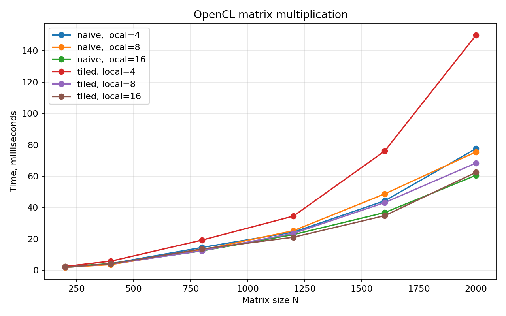
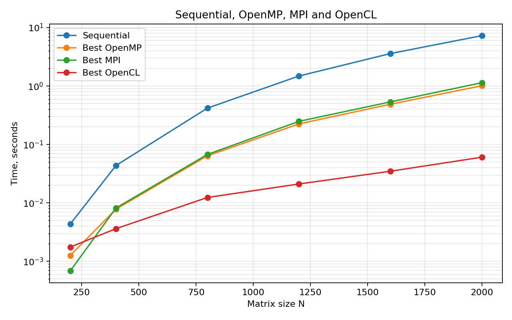
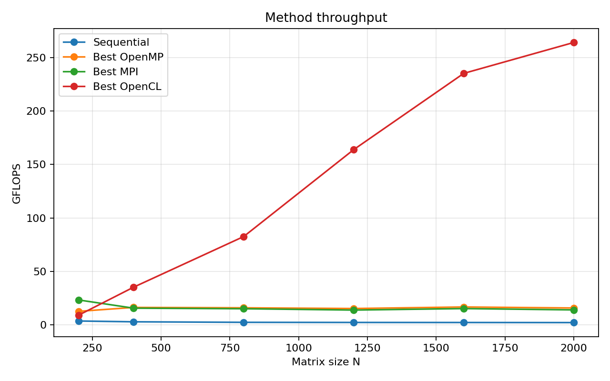
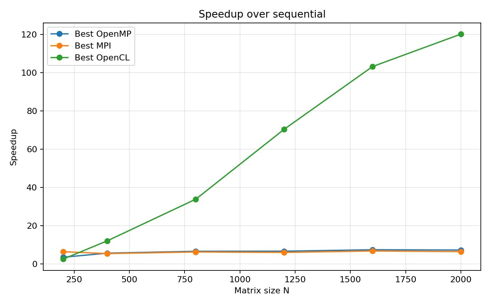

# Лабораторная работа №4. OpenCL

## Сведения о студенте

- Студент: Мась Андрей Алексеевич
- Группа: 6311
- Зачетная книжка: 2023-01326

## Задание

Модифицировать программу из лабораторной работы №1 для параллельной работы на
GPU. CUDA доступна только на видеокартах NVIDIA. На текущей машине используется
Apple M1 Pro, поэтому реализация выполнена на OpenCL как допустимая альтернатива
для GPU-вычислений без CUDA.

## Теоретические сведения

OpenCL - открытый стандарт для параллельных вычислений на разных устройствах:
CPU, GPU и ускорителях. Программа состоит из host-части на C/C++ и kernel-кода,
который выполняется на вычислительном устройстве.

Основные понятия OpenCL, использованные в работе:

- platform - реализация OpenCL от поставщика;
- device - конкретное вычислительное устройство, в этой работе Apple M1 Pro GPU;
- context - окружение, внутри которого создаются буферы и программы;
- command queue - очередь команд на устройство;
- kernel - функция, выполняемая параллельно множеством work-items;
- work-group - группа work-items, которая может совместно использовать local memory.

В матричном умножении один work-item вычисляет один элемент `C[i][j]`. В режиме
`tiled` work-group дополнительно загружает блоки матриц в local memory, чтобы
уменьшить число обращений к глобальной памяти. Такой прием полезен не на всех
архитектурах: на Apple M1 Pro накладные расходы local memory иногда оказываются
выше выигрыша.

## Системные характеристики

- Машина: MacBook Pro.
- Процессор: Apple M1 Pro, 10 CPU cores (`8 Performance + 2 Efficiency`).
- GPU: Apple M1 Pro, 16 GPU cores.
- Память: 16 GB unified memory.
- ОС: macOS 26.4.1.
- OpenCL: Apple OpenCL framework.
- Компилятор: Apple clang 17.0.0.
- Особенность устройства: `double` в OpenCL не поддерживается, поэтому GPU-ядро
  использует `float`.

## Реализация

OpenCL-программа находится в [matrix_opencl.cpp](./matrix_opencl.cpp).
Реализованы два варианта ядра:

- `naive`: каждый OpenCL work-item вычисляет один элемент результирующей матрицы;
- `tiled`: work-group загружает фрагменты матриц в local memory и затем считает
  элементы результата.

Размер work-group задается параметром `local_size`. Глобальная сетка округляется
вверх до кратного `local_size`, а лишние work-items выходят без записи результата.
На Apple M1 Pro допустимы конфигурации `4x4`, `8x8`, `16x16`; конфигурация
`32x32` превышает лимит устройства по размеру work-group.

Так как OpenCL-устройство Apple M1 Pro не поддерживает `double` в OpenCL
(`CL_DEVICE_DOUBLE_FP_CONFIG = 0`), вычисления в GPU-ядре выполняются в `float`.
Верификация проводится через NumPy с допуском `atol=1e-3`, `rtol=1e-4`.

## Запуск

```bash
make
./matrix_opencl sample_A.txt sample_B.txt result.txt 16 tiled
python3 verify.py sample_A.txt sample_B.txt result.txt
```

Полный эксперимент:

```bash
python3 benchmark.py
python3 plot_results.py
```

По умолчанию benchmark запускает размеры `200, 400, 800, 1200, 1600, 2000`,
размеры work-group `4, 8, 16` и режимы `naive, tiled`. Каждая конфигурация
запускается 3 раза. В таблице и на графике используется медиана времени, а
полные агрегированные данные сохранены в [results.csv](./results.csv).

## Верификация

Результаты каждого запуска сравнивались с NumPy. Максимальная абсолютная ошибка
во всей серии экспериментов составила `1.43e-04`, что укладывается в выбранный
допуск для вычислений одинарной точности.

## Результаты экспериментов

Время указано в миллисекундах. Измеряется OpenCL-участок программы: создание
буферов, копирование данных на устройство, выполнение ядра и чтение результата.
Генерация входных файлов и Python-верификация в это время не входят.

| N | Local size | Режим | Повторов | Медиана, мс | Среднее, мс | Std, мс | max abs error |
|---:|---:|---|---:|---:|---:|---:|---:|
| 200 | 4 | naive | 3 | 1.751 | 1.886 | 0.266 | 1.11e-05 |
| 200 | 4 | tiled | 3 | 2.442 | 2.443 | 0.002 | 1.11e-05 |
| 200 | 8 | naive | 3 | 1.924 | 1.922 | 0.080 | 1.11e-05 |
| 200 | 8 | tiled | 3 | 2.049 | 2.041 | 0.027 | 1.11e-05 |
| 200 | 16 | naive | 3 | 2.370 | 2.438 | 0.163 | 1.11e-05 |
| 200 | 16 | tiled | 3 | 2.022 | 2.091 | 0.125 | 1.11e-05 |
| 400 | 4 | naive | 3 | 4.238 | 4.117 | 0.265 | 2.60e-05 |
| 400 | 4 | tiled | 3 | 5.822 | 5.819 | 0.017 | 2.60e-05 |
| 400 | 8 | naive | 3 | 3.623 | 3.584 | 0.281 | 2.60e-05 |
| 400 | 8 | tiled | 3 | 3.981 | 3.875 | 0.249 | 2.60e-05 |
| 400 | 16 | naive | 3 | 4.204 | 4.227 | 0.049 | 2.60e-05 |
| 400 | 16 | tiled | 3 | 4.103 | 4.066 | 0.144 | 2.60e-05 |
| 800 | 4 | naive | 3 | 14.582 | 13.873 | 1.992 | 4.99e-05 |
| 800 | 4 | tiled | 3 | 19.265 | 19.887 | 2.908 | 4.99e-05 |
| 800 | 8 | naive | 3 | 13.016 | 12.363 | 3.384 | 4.99e-05 |
| 800 | 8 | tiled | 3 | 12.462 | 12.325 | 1.045 | 4.99e-05 |
| 800 | 16 | naive | 3 | 12.389 | 11.581 | 1.860 | 4.99e-05 |
| 800 | 16 | tiled | 3 | 13.603 | 13.217 | 0.937 | 4.99e-05 |
| 1200 | 4 | naive | 3 | 24.333 | 24.549 | 1.216 | 9.01e-05 |
| 1200 | 4 | tiled | 3 | 34.558 | 36.108 | 2.964 | 9.01e-05 |
| 1200 | 8 | naive | 3 | 25.221 | 25.876 | 5.538 | 9.01e-05 |
| 1200 | 8 | tiled | 3 | 23.522 | 22.730 | 2.148 | 9.01e-05 |
| 1200 | 16 | naive | 3 | 22.757 | 21.914 | 2.891 | 9.01e-05 |
| 1200 | 16 | tiled | 3 | 21.078 | 20.994 | 2.240 | 9.01e-05 |
| 1600 | 4 | naive | 3 | 44.301 | 43.363 | 3.947 | 1.19e-04 |
| 1600 | 4 | tiled | 3 | 76.021 | 77.442 | 4.362 | 1.19e-04 |
| 1600 | 8 | naive | 3 | 48.713 | 50.687 | 13.284 | 1.19e-04 |
| 1600 | 8 | tiled | 3 | 43.173 | 44.574 | 3.184 | 1.19e-04 |
| 1600 | 16 | naive | 3 | 36.789 | 37.918 | 2.768 | 1.19e-04 |
| 1600 | 16 | tiled | 3 | 34.822 | 34.943 | 1.898 | 1.19e-04 |
| 2000 | 4 | naive | 3 | 77.536 | 79.718 | 9.733 | 1.43e-04 |
| 2000 | 4 | tiled | 3 | 149.888 | 147.644 | 6.691 | 1.43e-04 |
| 2000 | 8 | naive | 3 | 75.469 | 86.864 | 33.178 | 1.43e-04 |
| 2000 | 8 | tiled | 3 | 68.367 | 68.018 | 2.216 | 1.43e-04 |
| 2000 | 16 | naive | 3 | 60.568 | 59.982 | 2.029 | 1.43e-04 |
| 2000 | 16 | tiled | 3 | 62.441 | 61.186 | 2.505 | 1.43e-04 |

## Графики









## Сравнение с предыдущими лабораторными работами

| N | Sequential, с | Best OpenMP, с | Best MPI, с | Best OpenCL, с | Ускорение OpenCL к seq |
|---:|---:|---:|---:|---:|---:|
| 200 | 0.004341 | 0.001258 | 0.000685 | 0.001751 | 2.5x |
| 400 | 0.043661 | 0.007814 | 0.008164 | 0.003623 | 12.1x |
| 800 | 0.418976 | 0.063973 | 0.067567 | 0.012389 | 33.8x |
| 1200 | 1.484108 | 0.224929 | 0.248670 | 0.021078 | 70.4x |
| 1600 | 3.595169 | 0.488038 | 0.535236 | 0.034822 | 103.2x |
| 2000 | 7.282340 | 1.010286 | 1.138494 | 0.060568 | 120.2x |

На больших матрицах OpenCL-версия заметно опережает CPU-реализации. На `N=2000`
лучшая OpenCL-конфигурация показывает `60.568` мс против `1.010286` с у лучшей
OpenMP-версии и `1.138494` с у лучшей MPI-версии. Это связано с тем, что GPU
имеет большое число вычислительных блоков и хорошо загружается однотипной
операцией умножения матриц.

## Выводы

OpenCL-версия успешно запускается на Apple M1 Pro и корректно вычисляет
результаты с учетом одинарной точности. Лучшее время для `N=2000` показал режим
`naive` с `local_size=16`: медиана `60.568` мс. Конфигурация `tiled` с
`local_size=16` близка к ней (`62.441` мс), но не превосходит ее.

Оптимизированный `tiled` вариант не всегда быстрее на данной архитектуре: для
некоторых размеров накладные расходы local memory превышают выигрыш от
повторного использования данных. При этом на `N=1600` tiled-конфигурация
`16x16` оказалась лучшей, поэтому выбор конфигурации нужно подтверждать
экспериментально.

По сравнению с предыдущими лабораторными работами OpenCL дает наибольшее
ускорение на крупных матрицах. Для `N=2000` ускорение относительно
последовательной версии составило `120.2x`, относительно лучшей OpenMP-версии -
примерно `16.7x`, относительно лучшей MPI-версии - примерно `18.8x`. Повторные
замеры важны: в некоторых конфигурациях стандартное отклонение заметно, поэтому
выводы сделаны по медиане трех запусков.
