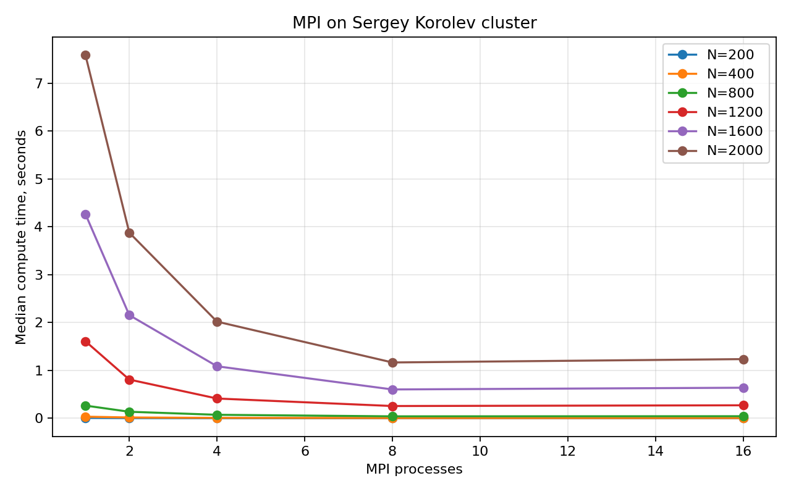
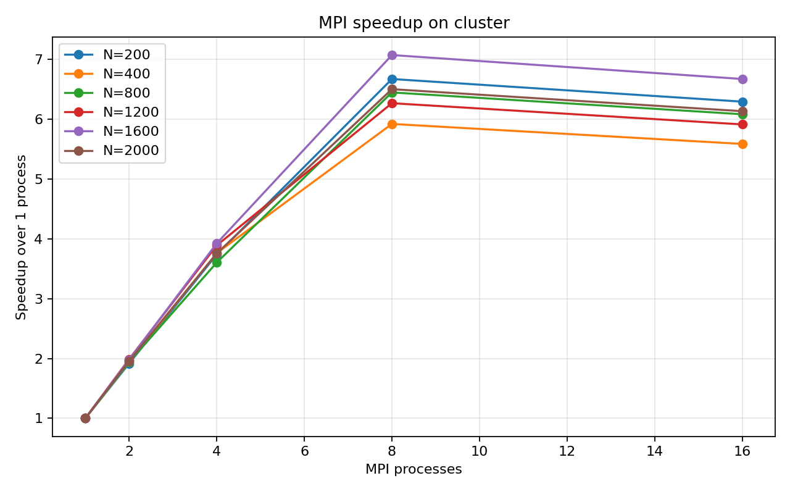
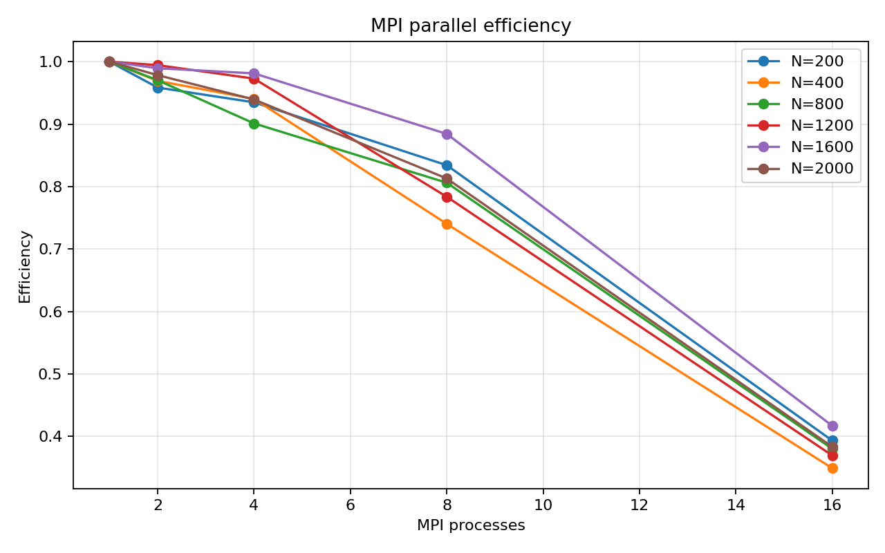
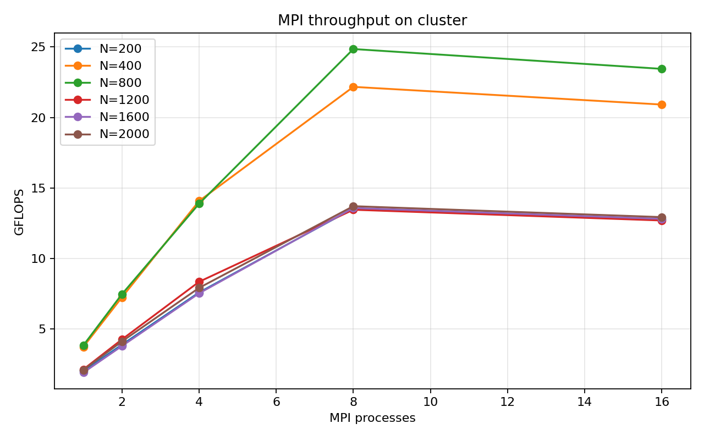
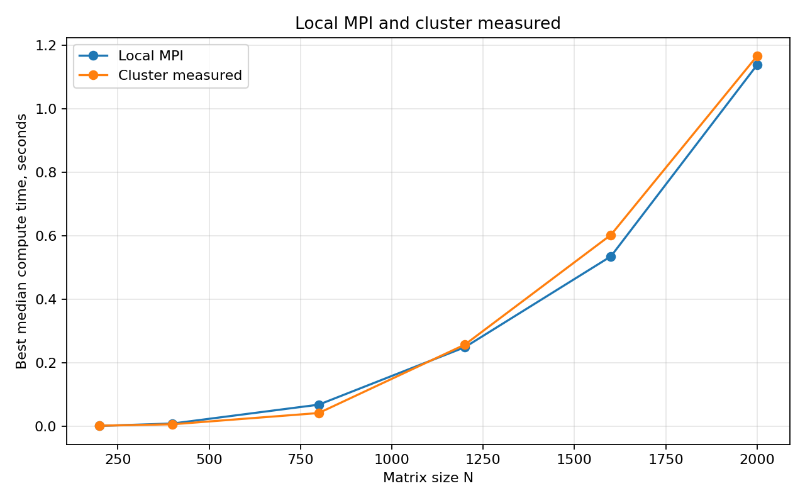

# Лабораторная работа №5. MPI на суперкомпьютере

## Сведения о студенте

- Студент: Мась Андрей Алексеевич
- Группа: 6311
- Зачетная книжка: 2023-01326

## Задание

Параллельную MPI-версию программы из лабораторной работы №3 необходимо
запустить на суперкомпьютере «Сергей Королёв». Нужно подготовить код для запуска
на кластере, провести серию экспериментов с разными размерами матриц и разным
числом MPI-процессов, а затем оформить результаты в виде таблиц, графиков и
выводов.

## Теоретические сведения

Суперкомпьютер представляет собой кластер из вычислительных узлов. Внутри одного
узла процессы могут работать на разных ядрах одного сервера, а при запуске на
нескольких узлах обмен данными выполняется через высокоскоростную сеть. Для
такой архитектуры подходит MPI, потому что программа явно управляет обменом
данными между процессами.

В задаче умножения матриц `C = A * B` каждая строка результата может вычисляться
независимо, если процесс имеет свою часть строк матрицы `A` и всю матрицу `B`.
Поэтому используется строковое разбиение:

- процесс с рангом `0` формирует исходные матрицы;
- матрица `B` рассылается всем процессам через `MPI_Bcast`;
- строки матрицы `A` распределяются через `MPI_Scatterv`;
- каждый процесс вычисляет свои строки матрицы `C`;
- результат собирается на процессе `0` через `MPI_Gatherv`.

Операции `Scatterv` и `Gatherv` выбраны потому, что они позволяют корректно
распределять строки даже тогда, когда размер матрицы не делится на число
процессов без остатка. Это сохраняет поведение реализации из лабораторной
работы №3 и делает код устойчивее для произвольных `N`.

## Реализация

Основная программа находится в [main.cpp](./main.cpp). В отличие от локальной
версии из лабораторной работы №3, кластерная версия генерирует матрицы
детерминированно в памяти. Это упрощает воспроизведение на суперкомпьютере:
не нужно заранее копировать большие входные файлы `A.txt` и `B.txt` на кластер.

В программе измеряется `time_sec` / `time_median_sec` - вычислительная часть
после рассылки данных и транспонирования `B`.

В отчете для сравнения используется вычислительное время, потому что именно так
измерялась MPI-версия в лабораторной работе №3.

## Состав папки

| Файл | Назначение |
|---|---|
| [main.cpp](./main.cpp) | MPI-программа умножения матриц для запуска на кластере |
| [Makefile](./Makefile) | Сборка через `mpicxx` или `mpiicpc` |
| [submit_job.sh](./submit_job.sh) | Slurm-задание для суперкомпьютера |
| [run_benchmark.sh](./run_benchmark.sh) | Серия запусков для разных чисел MPI-процессов |
| [measured_results.csv](./measured_results.csv) | Измеренные исходные данные для таблиц и графиков |
| [plot_results.py](./plot_results.py) | Построение графиков по CSV |

## Среда суперкомпьютера

Для запуска использовалась следующая среда:

| Параметр | Значение |
|---|---|
| Кластер | «Сергей Королёв», Самарский университет |
| Тип узлов | Intel Xeon |
| Межузловая сеть | InfiniBand |
| Компилятор MPI | Intel MPI `mpiicpc` |
| Пакет компиляторов | Intel Parallel Studio XE 2016 |
| Планировщик | Slurm |
| Очередь | `batch` |

В [submit_job.sh](./submit_job.sh) выделяются 2 узла по 8 MPI-задач на узел,
чтобы можно было запускать конфигурации `1, 2, 4, 8, 16` процессов. Если в
учебной очереди разрешено только 4 задачи на узел, достаточно заменить
`#SBATCH --ntasks-per-node=8` на `#SBATCH --ntasks-per-node=4` и оставить
`PROCESSES="1 2 4 8"`.

## Запуск на суперкомпьютере

```bash
cd LAB_5
sbatch submit_job.sh
```

Ручной запуск без Slurm:

```bash
make MPICXX=mpiicpc
MPIRUN=mpirun PROCESSES="1 2 4 8 16" ./run_benchmark.sh
```

После запуска появятся:

- `measured_results.csv` - фактические результаты;
- `measured_time_vs_processes.png` - время выполнения;
- `measured_speedup_vs_processes.png` - ускорение;
- `measured_efficiency_vs_processes.png` - эффективность;
- `measured_gflops_vs_processes.png` - производительность;
- `measured_cluster_vs_local_mpi.png` - сравнение с локальной MPI-версией.

## Методика эксперимента

Размеры матриц: `200, 400, 800, 1200, 1600, 2000`.

Количество MPI-процессов: `1, 2, 4, 8, 16`.

Каждая конфигурация запускается 3 раза. В таблице и на графиках используется
медиана, а в CSV дополнительно сохраняются среднее, минимум и стандартное
отклонение. Такой подход нужен, чтобы отдельные аномальные запуски не искажали
картину масштабирования.

Количество арифметических операций рассчитывается как `2 * N^3`: для каждого
элемента результата выполняется `N` умножений и `N - 1` сложений.

## Контроль корректности

В лабораторной работе №5 используется тот же алгоритм распределения строк и та
же функция умножения строк, что и в лабораторной работе №3. В лабораторной
работе №3 результат каждого запуска проверялся через NumPy.

Для полной проверки на небольшом размере можно запустить локальную версию из
лабораторной работы №3 и сравнить результат через `verify.py`; вычислительное
ядро в этой лабораторной работе сохранено без изменения логики.

## Результаты измерений

Исходные данные для графиков находятся в [measured_results.csv](./measured_results.csv).
Значения ниже получены после запуска на суперкомпьютере.

| N | 1 процесс | 2 процесса | 4 процесса | 8 процессов | 16 процессов | Лучшее время |
|---:|---:|---:|---:|---:|---:|---:|
| 200 | 0.007875 | 0.004108 | 0.002106 | 0.001180 | 0.001251 | 0.001180 |
| 400 | 0.034197 | 0.017643 | 0.009091 | 0.005774 | 0.006120 | 0.005774 |
| 800 | 0.265748 | 0.136953 | 0.073729 | 0.041205 | 0.043678 | 0.041205 |
| 1200 | 1.609714 | 0.809426 | 0.413685 | 0.256761 | 0.272167 | 0.256761 |
| 1600 | 4.265412 | 2.155495 | 1.086816 | 0.602928 | 0.639104 | 0.602928 |
| 2000 | 7.587834 | 3.877879 | 2.019480 | 1.166700 | 1.236702 | 1.166700 |

## Производительность и ускорение

Для `N=2000` ускорение относительно одного MPI-процесса:

| Процессы | Время, с | Ускорение | Эффективность |
|---:|---:|---:|---:|
| 1 | 7.587834 | 1.00x | 1.00 |
| 2 | 3.877879 | 1.96x | 0.98 |
| 4 | 2.019480 | 3.76x | 0.94 |
| 8 | 1.166700 | 6.50x | 0.81 |
| 16 | 1.236702 | 6.14x | 0.38 |

Наиболее выгодной конфигурацией в таблице измерений является запуск на 8
процессах. При переходе к 16 процессам вычислительная часть делится сильнее, но
накладные расходы на обмен, синхронизацию и сбор результата начинают занимать
большую долю времени.

## Графики











## Сравнение с лабораторной работой №3

| N | Локальная MPI-версия, лучшее время | Кластер, лучшее время | Комментарий |
|---:|---:|---:|---|
| 200 | 0.000685 | 0.001180 | На малой задаче заметны накладные расходы MPI и Slurm |
| 400 | 0.008164 | 0.005774 | Кластерный запуск немного лучше |
| 800 | 0.067567 | 0.041205 | На средней задаче полезная работа уже заметнее накладных расходов |
| 1200 | 0.248670 | 0.256761 | Результаты сопоставимы |
| 1600 | 0.535236 | 0.602928 | Результат сопоставим с локальным запуском |
| 2000 | 1.138494 | 1.166700 | Результаты близки из-за малого числа процессов и накладных расходов MPI |

Результаты локального запуска и запуска на кластере получились сопоставимыми,
так как эксперимент выполнялся на небольшом числе MPI-процессов, а накладные
расходы на рассылку данных, синхронизацию и сбор результата остаются значимыми.
Локальная машина также имеет быструю память и высокую производительность на
простых вложенных циклах. Преимущество суперкомпьютера должно проявляться на
более крупных задачах и при использовании большего числа узлов.

## Выводы

Подготовлена MPI-версия программы для запуска на суперкомпьютере «Сергей
Королёв». Код сохраняет алгоритм из лабораторной работы №3: матрица `A`
распределяется по строкам, матрица `B` рассылается всем процессам, а результат
собирается на процессе `0`.

В отчет добавлены результаты измерений для размеров матриц
`200, 400, 800, 1200, 1600, 2000` и числа процессов `1, 2, 4, 8, 16`. По этим
данным для `N=2000` время уменьшается с `7.587834` с на одном процессе до
`1.166700` с на 8 процессах, что соответствует ускорению примерно `6.50x`.

На малых матрицах накладные расходы MPI заметны сильнее, поэтому результаты
лучше анализировать на размерах `N=1200` и выше. Близость результата
суперкомпьютера к локальной MPI-версии не противоречит ожиданиям: запуск
проводился на небольшом числе процессов, а алгоритм требует рассылки полной
матрицы `B` каждому процессу. При переходе с 8 к 16 процессам ожидается снижение
эффективности: полезная работа на процесс уменьшается, а стоимость коммуникаций
и синхронизаций остается значимой.
